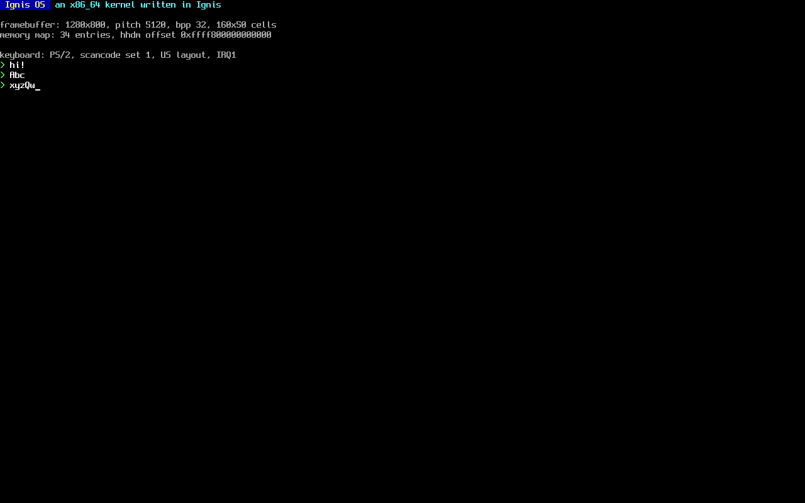

# IgniOS

A Unix-like x86_64 kernel written in [Ignis](https://github.com/Ignis-lang/ignis), booted by Limine on UEFI.

IgniOS is the first large Ignis program that lives outside the compiler. It doubles as a test bench: when the kernel hits a compiler bug, the bug is fixed in the compiler rather than worked around here. Volatile access, freestanding builds, C-layout records, C function pointers and Intel-syntax inline asm all landed in Ignis because this kernel needed them.



## Status

Early, and only tested in QEMU with OVMF.

| Area | State |
|---|---|
| Boot | Limine (base revision 6) on UEFI, higher-half ELF at `0xffffffff80000000` |
| Console | Framebuffer text console, Spleen 8x16 font, 16 ANSI colors, cursor, scrolling; mirrored to COM1 |
| CPU | Own GDT and TSS (IST stack for double faults), IDT with exception reports |
| Interrupts | 8259 PIC remapped to 0x20-0x2F; keyboard on IRQ1, idle loop sleeps with `sti; hlt` |
| Input | PS/2 keyboard, scancode set 1, US layout, Shift and Caps Lock, line editing at a `>` prompt |
| Memory | Bitmap frame allocator over the Limine memory map; own 4-level page tables (kernel image per segment with W^X, direct map with 2 MiB pages, write-combining framebuffer, NX and write protection on) |
| Next | Kernel heap, APIC/IOAPIC, scheduler, syscalls, userland |

## Quick start

You need Nix with flakes. The flake provides clang, lld, Limine, QEMU, OVMF, mtools and the font.

```sh
nix develop
make run
```

QEMU opens a window. Click it to give it the keyboard and type at the prompt. The terminal shows the serial log.

The build also needs an Ignis compiler with freestanding support (Ignis `main` from October 2026 or later). The Makefile looks for it at `../ignisc.rs/build/bootstrap/stage1/ignis`; point elsewhere with `make IGNIS=/path/to/ignis`.

## Make targets

| Target | What it does |
|---|---|
| `kernel` | Builds `build/kernel.elf` |
| `image` | Builds `build/ignios.img`, a FAT32 EFI system partition with Limine and the kernel |
| `run` | Boots in QEMU with the serial console on stdio |
| `run-headless` | Boots without a display and checks the banner and prompt in `build/serial.log` |
| `screenshot` | Boots headless and saves the screen to `build/screen.png` |
| `keytest` | Types keys through the QEMU monitor and checks the echo |
| `font` | Regenerates `kernel/src/font_8x16.ign` from the Spleen package |
| `clean` | Removes `build/` |

## How it is built

Ignis compiles the whole kernel to one C unit, which clang compiles for `x86_64-unknown-none` with kernel flags (no red zone, no SSE, `-mcmodel=kernel`). The few routines that cannot be written in Ignis are small `.S` files under `kernel/src/arch/x86_64/`: interrupt entry stubs and the code segment reload. `ld.lld` links everything with `kernel/linker.ld`, and `mtools` writes the boot image. No cross GCC is involved.

## Layout

```
kernel/src/main.ign            kmain, banner, panic handler, terminal loop
kernel/src/limine.ign          Limine requests and responses
kernel/src/console.ign         framebuffer text console
kernel/src/keyboard.ign        scancode set 1 decoder
kernel/src/ps2.ign             PS/2 controller
kernel/src/interrupts.ign      exception reports and IRQ dispatch
kernel/src/pmm.ign             physical frame allocator
kernel/src/vmm.ign             kernel page tables: map, unmap, translate, flush
kernel/src/hhdm.ign            physical memory through the higher half direct map
kernel/src/arch/x86_64/        GDT, IDT, PIC, port I/O and CPU helpers, .S stubs
kernel/linker.ld               higher-half layout
boot/limine.conf               boot entry
scripts/                       font generator, screenshot and key test drivers
```

## Acknowledgements

The overall approach (Limine, one generated C unit, clang and lld, assembly entry stubs) follows [Vinix](https://github.com/vlang/vinix), the operating system written in V.

## License

GPL-3.0-only, the same as the Ignis compiler. See `LICENSE`.

The console font is Spleen 8x16 by Frederic Cambus, under the BSD 2-Clause license. See `THIRD_PARTY.md` and `LICENSES/`.
